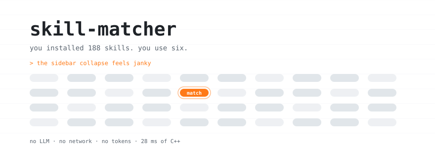

<div align="center">

<picture>
  <source media="(prefers-color-scheme: dark)" srcset="assets/hero-dark.svg">
  <source media="(prefers-color-scheme: light)" srcset="assets/hero-light.svg">
  
</picture>

<br>
<br>

[](#test)
[](LICENSE)
[](#)
[](#speed)

<br>

<a href="#why">Why</a> &nbsp;·&nbsp; <a href="#what-it-says">What it says</a> &nbsp;·&nbsp; <a href="#how-it-matches">How it matches</a> &nbsp;·&nbsp; <a href="#does-it-work">Does it work</a> &nbsp;·&nbsp; <a href="#install">Install</a> &nbsp;·&nbsp; <a href="#tuning">Tuning</a>

<br>

**A Claude Code hook that names the right skill before the model answers.**<br>
<sub>No LLM, no network, no tokens. C++ that exits in 28 ms.</sub>

</div>

<br>

---

## Why

I had 188 skills installed and was using about six.

Not because the rest were bad. Because the model never noticed they were there. Every skill's
description sits in context, but picking the right one out of hundreds is a recall problem, and
when recall fails it fails **silently** — no error, no "I couldn't find a skill", just a normal
answer that would have been better with the skill you installed for exactly that.

This scores your prompt against every installed skill and says so, before the answer starts.

<br>

## What it says

It has four voices, and three of them are quiet. Real output, from the real index:

```console
$ write the tests first
  Two skills fit: tdd or vitest. Invoke whichever matches, or neither if
  both miss — but decide, do not ignore.

$ make the chart colors accessible and add a legend
  Two skills fit: dataviz or ui-ux-pro-max.

$ the sidebar collapse feels janky
  Closest skill: ui-ux-pro-max. Invoke it if it fits — decide rather than skip.

$ thanks, looks good
  (nothing)
```

Measured across **972 real prompts** from my own transcripts:

| it says | share | when |
|:--|--:|:--|
| nothing | **38%** | below threshold, or chatter |
| `Two skills fit: X or Y` | 40% | several candidates, no clear winner |
| `Closest skill: X` | 15% | one candidate, nothing to compare it against |
| `Use the X skill for this` | **7%** | a clear winner, backed by ≥2 words you typed |

That silence matters as much as the rest. A hook that fires on every message gets tuned out the
moment it starts guessing, which is the same failure it was built to fix.

**It is capped at two names on purpose.** The previous version listed six, and a list of six is
a menu — you skim it and move on. The failure was never that the right skill was missing from
the line; it was that the line read as optional.

<br>

## How it matches

Three layers, all local, no model involved.

**IDF scoring.** Rare words count, common ones don't. `oklch` is a strong signal; "use" and
"when" appear in half the descriptions and are worth nearly nothing. A skill qualifies if the
prompt hits its *name*, or two or more words you actually typed — one generic word inside a
description is not a signal.

**Stemming.** "accessible" and "accessibility" have to meet somewhere or you get zero matches
while owning five accessibility skills. A ~45-suffix stripper, applied to both sides. It is not
trying to be linguistically correct; both sides only have to land on the same string.

**Concept groups.** Stemming cannot get you from "janky" to "performance" — different words,
not different forms. 48 fully-connected groups, 407 words. Words you type count full; words
inferred from a group count half, and **inferred evidence can never outvote what you typed** —
one word fans out to a dozen synonyms, and a skill listing all twelve was once collecting
twelve counts of proof from a single passing mention.

<br>

## Does it work

The honest answer used to be "nobody knows", and that is why this exists.

```console
$ skill-matcher --stats
no log yet at ~/.claude/skill-matcher/events.tsv — the hook has not run
```

Once it has, that becomes a summary and a table: how many times it spoke and how loudly, how
many distinct skills it named across how many sessions, how many were actually invoked, the
dates covered, and the one that matters — **followed: M of N**.

```console
$ skill-matcher --stats
suggestions   3  (1 decisive, 2 offered a choice)
skills named  4 distinct, across 3 sessions
invocations   2 logged
followed      2 of 4  (50%)
covering      2026-07-20 to 2026-07-26

skill                                     offered  followed
dataviz                                         1         0
humanizer                                       1         1
metal                                           1         1
ponytail:ponytail                               1         0
```

Those are illustrative rows from the test fixture, not a measured hit rate — the log starts
empty and this README is not going to invent one. The per-skill table is the actionable half:
an average tells you something is wrong, a skill offered forty times and never once followed
tells you *what*.

Two hooks and an append-only TSV: one line when a skill is suggested, one when a skill is
actually invoked, joined by session. Before this, a correct suggestion nobody acted on looked
exactly like a dead hook — which is how the previous version got rewritten on the assumption
its matches were bad, when they were fine.

<br>

## Install

```
/plugin marketplace add MiracleWeb3/skill-matcher
/plugin install skill-matcher@skill-matcher
```

> [!IMPORTANT]
> Needs a C++20 compiler on `PATH` (`c++`, i.e. g++ or clang++). The binary is compiled once at
> `SessionStart` into `${XDG_CACHE_HOME:-~/.cache}/skill-matcher/`, and rebuilt when the source
> is newer. With no compiler it says so once and stays silent — every failure path exits 0,
> because a hook that dies must never take your prompt with it.

> [!NOTE]
> Hooks are read at session start. Restart Claude Code after installing.

<br>

## Tuning

When it misses, that is a word, not an algorithm. Add it to the matching line in
`src/concepts.cpp`:

```cpp
{"animation", "animated", "motion", "transition", "easing", "spring", ...},
```

Then check it:

```console
$ skill-matcher --query "the thing that missed"    # score it by hand
$ skill-matcher --list                             # what got indexed
$ skill-matcher --stats                            # is any of this working
$ skill-matcher --test                             # regression suite
```

The thresholds are six constants, and the two that shape the voice are in `src/main.cpp`:
`kDecisive` (how far the top hit must beat the runner-up before it speaks as an instruction —
1.5, where the curve knees) and `kDecisiveTyped` (how many typed words must back it — 2, so a
lone coincidence is never asserted).

<br>

## How it works

```
  UserPromptSubmit
    │
    ├─  index every invocable skill      188 found        ─
    ├─  tokenize + stem the prompt       "janky" -> jank  ─
    ├─  expand through concept groups    +performance     ─
    ├─  score, threshold, rank           top = 12.4       ─
    └─  clear winner, ≥2 typed words?    no               ─
            │
            ▼
      "Two skills fit: X or Y"     ── logged, for --stats
```

| Event | Fires on | Does |
|:--|:--|:--|
| `SessionStart` | startup · resume · clear · compact | Compiles the binary if missing or stale |
| `UserPromptSubmit` | every prompt | Scores, speaks or stays quiet, logs what it offered |
| `PostToolUse` | `Skill` | Logs what was actually invoked — the other half of `--stats` |

<br>

## Test

```console
$ c++ -std=c++20 -O2 -DSM_SELFTEST -o /tmp/sm src/*.cpp && /tmp/sm --test
ok - 188 skills indexed, 25 name lookups + 8 silences + alias collapse, 56 checks
```

No framework, no fixtures. The suite builds itself from whatever skills the machine actually
has — asking for a skill by its own name must return it — so it stays honest on a different
library. Test code compiles in only under `-DSM_SELFTEST`.

<a id="speed"></a>The port from Python was verified differentially rather than by eye: **607
real prompts** through both implementations, compared as ranked output. **Zero mismatches**,
before a single behaviour change. Then the output shape changed, deliberately, on top of a
core proven identical. 158 ms → 28 ms.

<br>

## What it doesn't do

**It suggests, it doesn't decide.** The model still picks, and can still ignore it. This raises
recall; it does not guarantee it. That is exactly why `--stats` exists.

**It can only suggest skills you have.** Ask why a SQL query is slow with no database skill
installed and you get frontend performance skills, because those are the only slow-related
things on the machine.

**It matches words, not meaning — and sometimes that is plainly wrong.** Ask it to make a
README not sound like AI wrote it and it will offer `generating-sounds-with-ai`, because
"sound" and "ai" both land on that name, while the `humanizer` sitting right there scores
nothing. Roughly right in the top few, noise in the tail. The trade is deliberate: a wrong
suggestion costs one glance, a missing one costs a skill you never use.

<details>
<summary><b>Layout</b></summary>

<br>

```
src/main.cpp        hook I/O, the four voices, CLI
src/score.cpp       IDF scoring, thresholds, ranking
src/index.cpp       skill discovery, frontmatter, alias collapse, built-ins
src/concepts.cpp    48 concept groups, 407 words
src/text.cpp        tokenize, stem, chatter filter
src/json.cpp        enough JSON to read settings.json
src/log.cpp         suggested-vs-invoked, and the join behind --stats
src/selftest.inc    assertions, -DSM_SELFTEST only
```

Every file under 300 lines, per [metal](https://github.com/MiracleWeb3/metal).

</details>

<details>
<summary><b>Design notes</b></summary>

<br>

**Why a hook and not a CLAUDE.md line.** "Remember to check your skills" is advice the model
weighs against everything else in context and loses under pressure. A hook is arithmetic.

**Why silence is most of the behaviour.** 38% of real prompts get nothing. The version that
spoke constantly was the version that got ignored, and an ignored hook is indistinguishable
from a broken one.

**Why confidence needs a runner-up.** A single candidate has nothing to be measured against, so
it is reported as the closest match, never asserted as the right one. Asserting it is how "not
sound like ai wrote it" confidently recommended a sound-synthesis skill.

**Why the scoring was left alone in the C++ port.** It was rewritten once already on the
assumption the matches were bad. They were fine. Porting first and proving it identical means
the next change can be measured against something, instead of guessed at again.

</details>

<br>

---

<div align="center">
<sub>MIT · built for <a href="https://claude.com/claude-code">Claude Code</a></sub>
</div>
